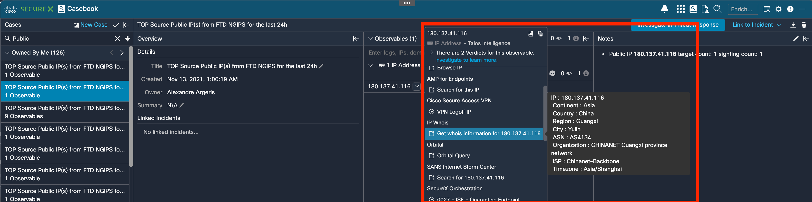

# Cisco SecureX IPWhois module

Create IP Whois module in Cisco SecureX.



Lookup IP WHOIS information using the ipwhois.io api for any allocated public IP address.

The Relay itself is just a simple application written in Python that can be
easily packaged and deployed as an AWS Lambda Function using
[Zappa](https://github.com/Miserlou/Zappa).

Use cases :
  - Get Whois information for public IP (Continent, Country, Region, City, ASN, Organization, ISP, Timezone)

For any questions or comments/bugs please reach out to me at aargeris@cisco.com

## Rationale

1. We need an application that will translate API requests from SecureX Threat Response
to Cisco PSIRT API. This application is provided here in the GitHub repository, and we are going to install it in AWS Lambda
using Zappa.

2. AWS Lambda allows us to deploy our application without deploying a dedicated
server or paying for so called "idle" cycles. AWS handles instantiation and
resource provisioning; all we need to do is define the access rights and upload
our application.

3. Zappa is a helper tool that will package our application and publish it to
AWS as a Lambda function. It abstracts a large amount of manual configuration
and requires only a very simple configuration file, which we have provided and
will explain how to customize it during this process.

## Step 1: Requirements Installation

First of all, make sure that you already have Python 3 installed by typing
```
python3 --version
```
in your command-line shell.

The application has been implemented and tested using `Python 3.7`. You may try
to use any higher versions if you wish as they should be backward-compatible.

After that, you have to create a "virtual environment" to isolate the
application-specific requirements from the libraries globally installed to your
system. Here are the steps to follow:

1. Create a virtual environment named `venv`:

   `python3 -m venv venv`

2. Activate the virtual environment:
   - Linux/Mac: `source venv/bin/activate`
   - Windows: `venv\Scripts\activate.bat`

3. Upgrade PIP (optional):

   `pip install --upgrade pip`

**NOTE**. The virtual environment has to be created only once, you just have
to make sure to activate it each time you are working on or playing with the
application (modern IDEs can automatically do that for you). You can deactivate
a previously activated virtual environment by simply typing `deactivate` in
your command-line shell.

Finally, install the libraries required for the application to function from
the [requirements.txt](code/requirements.txt) file:

```
pip install --upgrade --requirement requirements.txt
```

## Step 2: Application Deployment

### AWS Lambda Function

First set up your deployment settings for you with the following command:
```
zappa init
```

To `deploy` your application to AWS as a Lambda function for the first time,
run the following command:
```
zappa deploy dev
```

**NOTE**. Here `dev` is just the name of the default stage. You may define as
many stages as you like. Each Zappa command requires a stage to be specified so
make sure to replace `dev` with the name of your custom stage when necessary.

Once the Lambda has been deployed, make sure to save the public `URL` to your
Lambda returned by Zappa. It will look like this:
```
https://<RANDOM_ID>.execute-api.<AWS_REGION>.amazonaws.com/<STAGE>
```

You can check the `status` of your deployment with the corresponding command:
```
zappa status dev
```

Notice that you have to `deploy` your Lambda only once. Each time you make
changes to the source code or to the settings file you just have to `update`
the Lambda by running the following command:
```
zappa update dev
```

As a bonus, you can also monitor your Lambda's HTTP traffic in near real-time
with the `tail` command:
```
zappa tail dev --http
```

If you do not need your Lambda anymore you can run the following command to
get rid of it altogether and clean up the underlying resources:
```
zappa undeploy dev
```

**NOTE**. The `deploy` command always returns a brand new `URL`. The `update`
command does not change the current `URL`. The `undeploy` command destroys the
old `URL` forever.


For any questions or comments/bugs please reach out to me at aargeris@cisco.com
